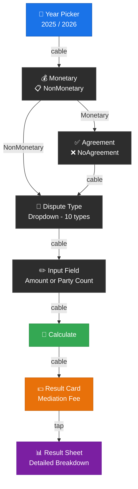
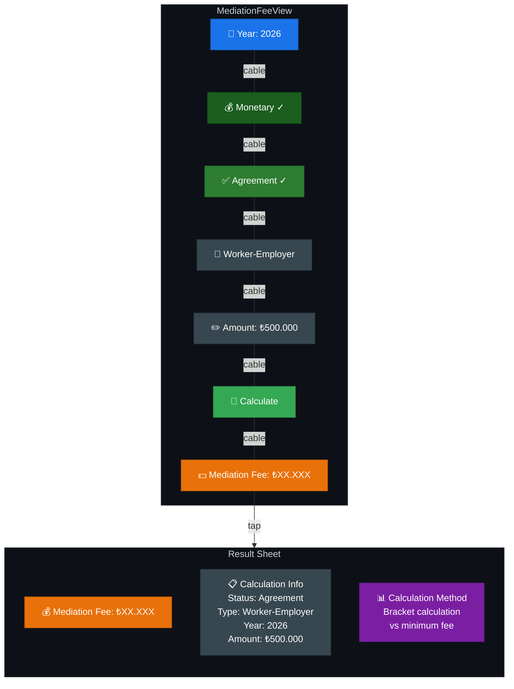
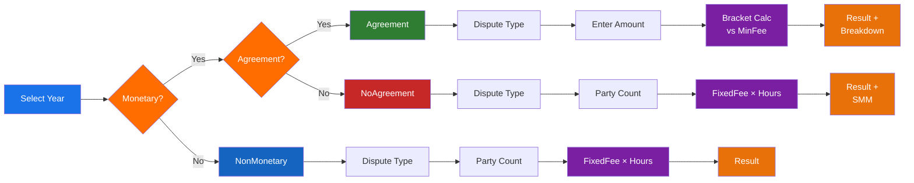

# 🧮 Mediation Fee Calculation System

> Visual guide to the mediation fee calculation flow in DENKLEM app.

---

## 📐 Calculation Screen Layout

The mediation fee screen presents a unified, top-to-bottom flow connected by visual **cable connectors**. Here is the layout of the screen:

---

## 🎯 Example Scenario: Monetary → Agreement → Worker-Employer

The following diagram shows a complete calculation flow with an example:

---

## 🔀 All Calculation Paths

There are **3 main calculation paths** depending on user selections:

---

## 📊 Calculation Methods Summary

| Path | Input | Calculation | Result Details |
|------|-------|-------------|----------------|
| **Monetary + Agreement** | Dispute Type + Amount (₺) | Progressive bracket rates vs. minimum fee (higher wins) | Fee + Bracket breakdown |
| **Monetary + No Agreement** | Dispute Type + Party Count | Fixed fee × minimum hours multiplier | Fee + SMM (withholding tax) breakdown |
| **Non-Monetary** | Dispute Type + Party Count | Fixed fee × minimum hours multiplier | Fee amount |

---

## 🏗️ Available Dispute Types

| # | Dispute Type | Key |
|---|-------------|-----|
| 1 | Worker-Employer | `worker_employer` |
| 2 | Commercial | `commercial` |
| 3 | Consumer | `consumer` |
| 4 | Rent | `rent` |
| 5 | Partnership Dissolution | `partnership_dissolution` |
| 6 | Condominium | `condominium` |
| 7 | Neighbor | `neighbor` |
| 8 | Agricultural Production | `agricultural_production` |
| 9 | Family | `family` |
| 10 | Other | `other` |
